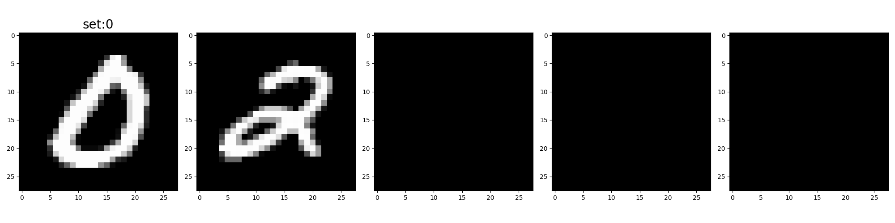
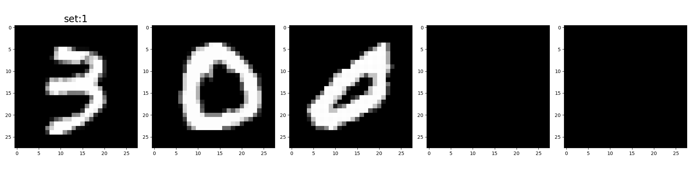
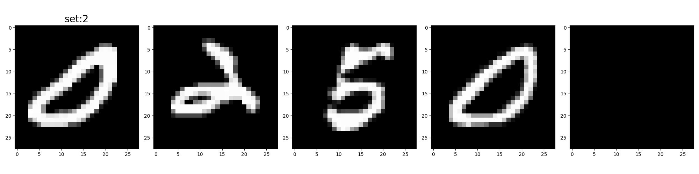
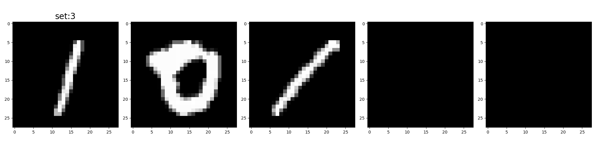
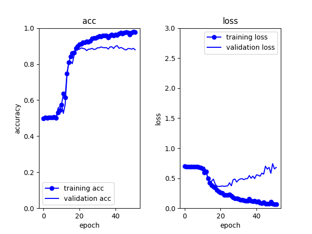
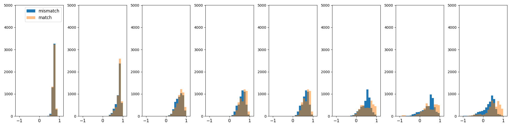
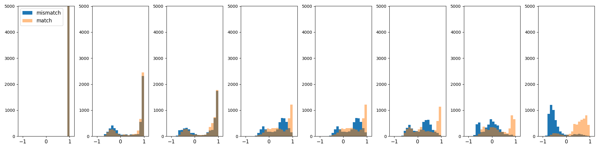
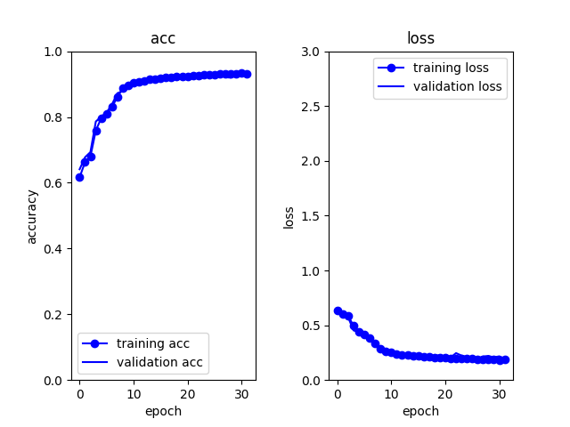

This repository provides data and codes used in the paper *Set representative vector and its asymmetric attention-based transformation for heterogeneous set-to-set matching* submitted to Neurocomputing.

## Contents
1. [Installation](#installation)
1. [Structure of folders and files](#structure)
1. [Heterogeneous set-to-set matching tasks](#task)
1. [Citation](#citation)

## Requirement
- Python 3.9
- Tensorflow 2.9.1
- Tensorflow addons

<a id="installation"></a>
## Installation
To get started with the project, follow these steps:
#### 1. Clone the repository.
```bash
$ git clone https://github.com/hhachiya/set_rep_vector_and_asymmetric_attention.git
```
#### 2. Install the required packages from the ```requirements.txt``` file using conda:
```bash
$ conda create --name xxx --file requirements.txt
```
#### 3. Download a zip file for each dataset, i.e., MNIST and shift15m, from [Google Drive](https://drive.google.com/drive/folders/1q6PLDC-nNkYsG9mdE_BoI_UBq6uMXtvS?usp=sharing) and place unzipped files to the corresponding ```pickle_data``` folder under each dataset folder as the following structure.  

#### 4. Execute run.py of each dataset to train and evaluate models as follows:
```bash
python run.py [-mode MODE] [-baseChn BASECHN] [-num_layers NUM_LAYERS] [-num_heads NUM_HEADS] [-is_set_norm IS_SET_NORM] [-is_cross_norm IS_CROSS_NORM] [-trial TRIAL]
```
#### Option:
- MODE
    - int : mode of computing set-matching score, maxPooling:0, poolingMA:1, CSS:2, setRepVec_biPMA:3, setRepVec_pivot:4, default:0
- BASECHN
    - int : number of base channel, default=32
- NUM_LAYERS
    - int : number of layers (attentions) in encoder and decoder, default=3
- NUM_HEADS
    - int : number of heads in attention, default=5
- IS_SET_NORM
    - int : switch of set-normalization (1:on, 0:off), default=1
- IS_CROSS_NORM
    - int : switch of cross-normalization (1:on, 0:off), default=1
- TRIAL
    - int : index of trial, default=1

#### 5. Exececute comp_result.py of each dataset to compare the performance of multiple models with different numbers of layers and headsas follows:
```bash
python comp_result.py [-modes MODES] [-baseChn BASECHN] [-num_layers NUM_LAYERS] [-num_heads NUM_HEADS] [-is_set_norm IS_SET_NORM] [-is_cross_norm IS_CROSS_NORM] [-trials TRIALS]
```
#### Option:
- MODES
    - string : list of score mode indices split by comma, default='3,4'
- BASECHN
    - int : number of base channel, default=32
- NUM_LAYERS
    - string : list of numbers of layers split by comma, default='3'
- NUM_HEADS
    - string : list of numbers of heads split by comma, default='5'
- IS_SET_NORM
    - int : switch of set-normalization (1:on, 0:off), default=1
- IS_CROSS_NORM
    - int : switch of cross-normalization (1:on, 0:off), default=1
- TRIALS
    - string : list of indices of trials, default='1,2,3'

<a id="structure"></a>
## Structure of folders and files
```
  set_rep_vector_and_asymmetric_attention/
    |── models.py
    |── util.py
    │
    ├── MNIST/
    │   ├── run.py
    │   ├── compare_result.py
    │   ├── experiment/
    │   └── pickle_data/
    │       ├── MNIST_eventotal_3_5.pkl
    │       └── MNIST_eventotal_5_5.pkl
    │ 
    ├── market1501/
    │   ├── run.py
    │   ├── make_dataset.py
    │   ├── compare_result.py
    │   ├── experiment/
    │   └── pickle_data/
    │       ├── train_group_person3.pkl
    │       └── test_group_person3_cand5.pkl
    │
    ├── shift15m/
        ├── run.py
        ├── make_dataset.py
        ├── compare_result.py
        ├── experiment/
        └── pickle_data/
            └── 2017-2017-split0
                ├── test_example_cand5.pkl
                ├── test.pkl
                ├── train.pkl
                └── valid.pkl
```

<a id="task"></a>
## Heterogeneous set-to-set matching tasks
Demonstrations of heterogneous set-to-set matching using two datasets:even-total matching and fashion outfit matching tasks, are provided.

### MNIST even-total matching
As a simple heterogneous setting, we defined the matching based on the result of numerical calculations, i.e., if the sum of handwritten digit images in a par of sets is even (match) or odd (mismatch). 
For this purpose, we used [MNIST](https://yann.lecun.com/exdb/mnist/) dataset consisting of 60,000 images for training and 10,000 images for testing.
From each training and test dataset, we created sets of images with digit 0-5 in order from the beggining of the dataset by randomly selecting the number of items (images)---the max number of items is 3 or 5 as follows:  
&emsp;  
&emsp;

As a batch training and evaluation, all possible pairs of different sets in a mini-batch of 20-set are treated (see ```batch_size=20``` in run.py), i.e., 20x20-20=380 sets.
The following table lists the breakdown numbers of sets for training and testing---for computational effiency, the first 5000 sets (see ```num_train=5000``` in run.py) are used for training.

|  type  |  # of train  | # of test |
|:---- |:----:|:----:|
|  max 3 items |  11952  | 3014 |
|  max 5 items | 17930  | 1989 | 

#### Additional option of run.py and comp_result.py
- --nItemMax NITEMAX
    - maximum number of items in a set (3 or 5), default=5

#### Example
To train setRepVec_biPMA and setRepVec_pivot model for the trial 1-3 and the maximum number of items being 5, execute ```run.py``` as follows:
```bash
for trial in {1,2,3}; do for mode in {3,4}; do python run.py --mode $mode --trial $trial --nItemMax 5; done; done
```
Trained model and evaluation results are saved in ```experiment/[model_path]/[trial_index]```, e.g., ```experiment/setRepVec_pivot_32_setnorm_crossnorm/1```.
The following images are examples of visualization of training/validation curves and the discriminative vector transformations in ```[trial_index]/result``` folder.
- training/validation accuracy/loss curves:  
  
- histogram of similarities of item vectors between set pairs in test data:  
  
- histogram of similarities of set-rep vectors between set pairs in test data:  


To compare the performance of multiple models for test data, execute ```comp_result.py``` as follows:
```bash
> python comp_result.py -modes 3,4 -trials 1,2,3
                           test_loss        test_acc       
                                mean    std     mean    std
head mode            layer                                 
5    setRepVec_biPMA 3         0.479  0.076    0.871  0.005
     setRepVec_pivot 3         0.540  0.060    0.882  0.006
```

### Shift15M fashion outfit matching:
[Shift15M](https://github.com/st-tech/zozo-shift15m) is the dataset collected by a fashion social networking service, IQON, with approximately two million users in the past decade.
The outfit is a set of multiple items, e.g., outerwear, tops, bottoms, shoes, and bags; thus, the matching problem is a heterogeneous setting.
Here, positive paired sets are provided by randomly halving the given highly
rated outfit (set) into two subsets, and the negative sets are created by combining the subsets randomly without restriction. 
We used the outfits collected in 2017 with a random-seed (provided dataset split) of 0. 

The following table lists the breakdown numbers of sets for training, validation and testing.
|  # of train  | # of validation | # of test |
|:----:|:----:|:----:|
|  30,815 |  3,851  | 3,851 |

Each set consists of 4,096-dimensional item vectors provided by the Shift15M dataset, and we set the
maximum number of items to 5 (see ```max_item_num=5``` in run.py).
For the training, a batch training of 10-set (see ```batch_size=10``` in run.py) is used with negatvive-down sampling where randomly selected negative (mismatch) set pairs are removed to make the ratio between positive and negative pairs same (see ```is_neg_down_sample = True``` in run.py).
For the evaluation, we used 19,255 query and gallery pairs; each query set was selected five times from 3,851 test sets, and each gallery consists of one positive set and four negative sets (see ```test_cand_num=5``` in run.py).

#### Example
To train setRepVec_biPMA and setRepVec_pivot model for the trial 1-3, execute ```run.py``` as follows:
```bash
for trial in {1,2,3}; do for mode in {3,4}; do python run.py --mode $mode --trial $trial; done; done
```
- training/validation accuracy/loss curves:  
  

To compare the performance of multiple models for test data, execute ```comp_result.py``` as follows:
```bash
> python comp_result.py -modes 3,4 -trials 1,2,3
                           test_loss        test_acc         CMC=1         CMC=2         CMC=3        CMC=4      CMC=5     
                                mean    std     mean    std   mean    std   mean    std   mean    std  mean  std  mean  std
head mode            layer                                                                                                 
5    setRepVec_biPMA 3         0.226  0.007    0.916  0.002  0.885  0.014  0.986  0.003  0.998  0.001   1.0  0.0   1.0  0.0
     setRepVec_pivot 3         0.209  0.006    0.922  0.002  0.898  0.016  0.987  0.003  0.998  0.002   1.0  0.0   1.0  0.0
```

<!-- ### market1501:
#### Additional option of run.py and comp_result.py
- --batch_grp_num BATCH_GRP_NUM
    - number of groups in a batch, default=5
- --min_cam_num MIN_CAM_NUM
    - minimum number of camera, default=2 -->


<a id="citation"></a>
## Citation
```
@inproceedings{neurocomputing:hachiya:2024,
  title={Set representative vector and its asymmetric attention-based transformation for heterogeneous set-to-set matching},
  author={Hirotaka Hachiya and Yuki Saito},
  booktitle={Neurocomputing},
  year={2024}
}